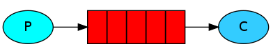
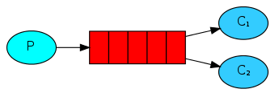
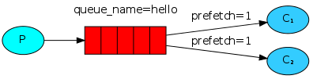
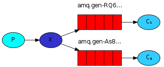
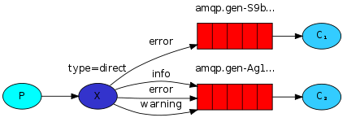
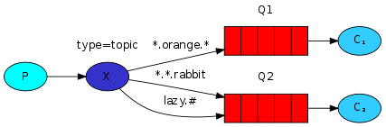

# RabbitMQ Notes

## JMS VS AMQP


### AMQP 术语解释


## Code in Java client

### 简单队列



简单队列中，生产者与消费者一一对应，如果此时想有多个消费者共同消费队列中的消息，就不能实现。

### 工作队列



一般而言，生产者产生数据可能是毫不费力的，而消费者可能由于业务复杂性的诸多原因，导致消费数据的能力不足，如果采用简单队列的模式，会出现大量消息积压在消费队列中。为了解决简单队列的不足，出现了工作队列。

多个消费者共同消费一个队列中的数据，队列向消费者发送数据时所采取的策略有两种：

- 轮询分发
- 公平分发

**轮询分发**是指，队列并不会根据消费者的处理能力去动态的调节消息的发送，消息总是你一个我一个的方式发送给多个消费者。如果其中有的消费者处理能力强，而有的消费者处理能力弱，就会出现能力弱的消费者疲于处理消息，而能力强的消费者处于空闲的状态。

在消息分发的过程中，队列只会一股脑的分发，并不知道消费者对消息处理的状态，如果此时有一个消费者异常了，队列还是继续发送消息，这种情况下，就会出现消息的丢失。为什么会出现这种状况？这是由于队列与消费者之间是没有通信的，消费者通过自动应答(`autoAck=true`)来通知队列，这种情况下可能出现消息的丢失。

如何解决消息的丢失问题？改变消息的应答模式，即`autoAck=false`，使用手动应答的机制。如果有消费者异常，队列就会将消息发送给其他消费者去处理。在手动应答的机制下，消息正确抵达消费者时，会向队列返回一个应答，队列接受到手动返回的应答消息时，才会从内存中删除消息。

保证了消费者在异常时不丢失数据的状况下，当队列服务异常时，也会出现消息的丢失，此时需要设置消息队列的持久化机制。需要通过`durable = true`来开启消息的持久化。


**公平分发**是指，队列根据消费者的处理能力动态去调剂消息的发送，表现为能者多劳，所有的消费者共同在更多的时间内，将队列中的消息处理完毕。

解决了消费者和队列丢失数据的情况，此时需要考虑如何解决公平分发的问题。



```java
int prefetchCount = 1;
channel.basicQos(prefetchCount);
```

通过配置`prefetchCount = 1`来告诉消息队列，每次只向消费者发送一条消息，也就是说，只有当消费者处理了前一个消息，队列才会给它发送新的消息，如果当前消费者一直忙于处理当前消息，队列就会向其他消费者发送消息。


### 发布订阅模式



在上面的简单队列和工作队列中，队列中的消息只有一份，被一个消费者消费了，其它的消费者就不能消费了。这在某些场景下是不适用的，所有需要另外一种模式，即发布/订阅模式，这和我们去杂志社订阅杂志相似。

在发布/订阅模式中，可以有一个生产者和多个消费者，每个消费者都关联着自己的队列。生成者并没有直接将消息发送到队列中，而是发送到交换器(exchange)中，之后交换器将消息推送到每一个和它绑定(binding)的队列中。

值得注意的是，交换器本身是不具备存储数据的能力，当一个交换器没有绑定任何的队列时，生产者向交换器中发送数据，数据会全部丢失。

#### fanout exchange

fanout 交换器模式下，不处理路由键，直接进行匿名转发，将所有的消息全部推送到与之绑定的各个队列中。

#### direct exchange

direct 交换器模式下，处理路由键，根据不同的路由键将不同的消息推送到不同的队列中。




#### topic exchange

topic 交换器模式下，由路由键和关键字共同生效。



其中，`#` 代表可以匹配一个或多个字符串，`*` 代表可以匹配一个字符串，所以按照这个规则，我们可以判断以下的消息会进入哪个队列中。

``` 
quick.orange.rabbit: 同时满足了 *.orange.* 和 *.*rabbit 
lazy.orange.elephant：同时满足了 *.orange.* 和 lazy.#
quick.orange.fox：只满足了 *.orange.*
lazy.brown.fox：只满足了 lazy.#
lazy.pink.rabbit：同时满足了 *.*rabbit 和 lazy.#，但只会进入队列中一次
```


## Code in Spring


## Code in Springboot


