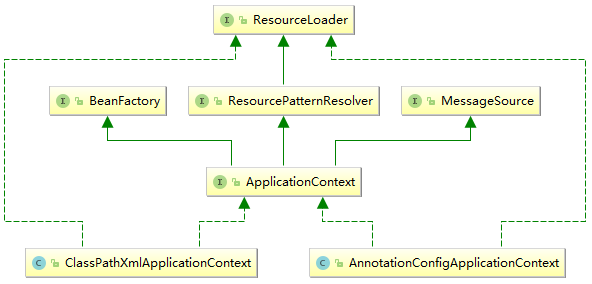

## Spring 注解驱动开发(一) 从XML配置到Annotation配置

### 前言

#### 什么是注解？

注解可以通俗地理解为一个标签，标签可以标识该事物具有某一类的特征，但是标签对该事物并没有本质上的影响。就类似与我们生活中的昵称之类的，你可以称呼一个人的昵称或者大名，但如何称呼一个人对他本质上没有什么影响。

程序代码世界的注解也类似与此，我们可以在需要标注的位置直接使用Java、Spring或其他的注解，但是只有这些注解是完全不够的。比注解更为重要的是注解的解析器，如果没有注解的解析器，所有标注的注解就没有办法生效，就失去了注解的意义。

就好比，当大家在一个熟悉的环境中称呼一个人的昵称，大家都心知肚明，知道在和谁聊天，昵称这个标签也就生效了；当在一个陌生的环境中，再去称呼一个人的昵称，大家可能会一头雾水或者判断错误，此时标签(注解)就失效了，这个例子中的环境就好比是一个解析器。

这么看来，Spring就是一个很大的解析器。注解的解析器一般都是在运行时对注解进行解析，常常会用到反射，通过反射检查在运行时，某个类、方法、或者字段是否被某些注解标注，如果被标注就可以动态地为这些类或方法进行赋值或增强，最终返回一个增强(代理)后的对象，这其实就是动态代理的技术。

### Spring 全面拥抱注解

Spring提倡我们完全使用注解(annotation)来替代原来的xml配置文件。但，是否要完全替代xml配置的方式，需要根据不同的应用场景来确定，这属于编码风格与规范的范畴。

#### xml配置

```xml
<?xml version="1.0" encoding="UTF-8"?>
<beans xmlns="http://www.springframework.org/schema/beans"
	xmlns:context="http://www.springframework.org/schema/context" 
	xmlns:xsi="http://www.w3.org/2001/XMLSchema-instance"
	xsi:schemaLocation="http://www.springframework.org/schema/beans
                        http://www.springframework.org/schema/beans/spring-beans-4.2.xsd
                        http://www.springframework.org/schema/context
                        http://www.springframework.org/schema/context/spring-context.xsd">
	<context:property-placeholder location="..." />
	<bean class="...">
		<property name="demo" value="..."  />
	</bean>
</beans>
```

上面是一个典型的Spring xml配置文件，引入了beans和context命名空间，如果需要其他的功能支持，如AOP、事务、安全等，可以再引入相应的命名空间。

在配置文件中，可以通过`<bean>`标签向Spring的容器中注册一个bean，可以使用context标签来指定关于Spring上下文的一些信息，当然还有更多复杂而详尽的配置，有需要的可以自行查询。

在xml配置文件中定义好了需要的bean以后，可以通过一个Java的主程序(main方法)将整个Spring容器激活。

```java
public static void main(String[] args) {
        ClassPathXmlApplicationContext applicationContext = 
            new ClassPathXmlApplicationContext("指定xml配置文件的位置");
        System.out.println(applicationContext);
}
```

通过这个main方法，Spring容器得到了激活，其中需要指定xml配置文件的位置，Spring在激活过程中会根据配置文件中配置信息，将所有的Bean进行实例化，最终保存在IOC容器中。所谓的IOC容器，本质上就是一个Map，其中以KV的方式保存了所有经过Spring实例化以后Bean。这些Bean在实例化的过程中，Spring会细致的检查这些Bean是否需要增强，最终往往保存在IOC容器中的都是经过增强(代理)的对象。

#### 注解配置

我们可以通过注解配置的方式来替代xml配置的方式，但两者本质上都没有发生改变，原来需要向IOC容器中注册Bean，现在还依然需要，只是实现的手段发生了改变。

```java
@Configuration
public class MainConfig {
    // 向容器中注册一个Bean;类型为返回值的类型，id 默认用方法名作为id
    @Bean
    public Person person() {
        return new Person("lma", 21);
	}
}
```

上面是一个简单而又典型的注解配置类，本质上就是一个Java类，通过@Configuration注解来标注声明这是一个Spring的配置类。然后再通过@Bean注解标注在一个方法上，向IOC容器中注册一个Bean，Bean的类型为方法返回值的类型，默认地使用方法名作为id。

```java
@Target(ElementType.TYPE)
@Retention(RetentionPolicy.RUNTIME)
@Documented
@Component
public @interface Configuration {
	@AliasFor(annotation = Component.class)
	String value() default "";
}
```

上面是@Configuration注解的源码，通过查看源码，发现这个注解是@Component的一个子注解。然后，我们依然可以在一个Java的main方法中，将这个以注解形式配置的Spring容器激活。

```java
public static void main(String[] args) {
        AnnotationConfigApplicationContext applicationContext =
                new AnnotationConfigApplicationContext(MainConfig.class);
        System.out.println(applicationContext);
}
```

通过这个main方法，并传入配置类的类文件，就可以激活该Spring容器。

可以通过一个uml的关系图来更加清晰的看一下以上两者之间的关系，由于这个继承关系很复杂，所以类很多，只将AnnotationConfigApplicationContext和ClassPathXmlApplicationContext简要地画出来，更加详尽的继承关系图可以通过IDEA的show diagram功能来展现。



---

在激活了Spring容器以后，使用的方式就和以前一模一样。下一节中，我们将通过不同的方式，来向Spring IOC容器中注入Bean。

本文描述的过程中，有时候使用了Spring容器，有时候使用了IOC容器，这仅仅是两种不同的叫法，本质就是同一个东西，没有任何区别。

