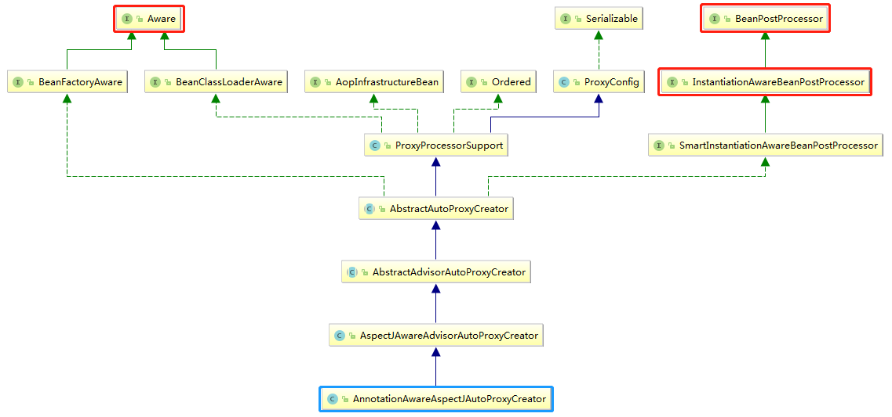

## Spring 注解驱动开发(六) 面向切面编程的原理

面向切面编程(Aspect Oriented Programming，AOP)，是相对于面向对象而言的。依赖于代理技术的AOP技术，描述了一种程序运行期间动态地将某段代码切入到指定方法的指定位置进行运行的编程方式。它的最终目的是为了解耦，可以让一组对象共享某个行为，常用于实现日志、异常、性能等非业务性的功能。

### Spring AOP 初体验

Spring 框架对于AOP的适配做得很好，尤其是全面支持注解开发后，我们可以使用简单的注解就可以实现AOP的开发。下面，我们先用一个例子，来看下基于注解方式下的Spring AOP开发。

我们要定义4个类，分别是切面类、业务类、配置类和测试类：

```java
@Aspect // 使用@Aspect声明这是一个切面类
public class LogAspects {
    /**
     * {@link Pointcut} 抽取公共的切入点表达式
     * 1> 本类引用：直接使用方法名
     * 2> 其他的切面类引用：使用全方法名(全类名+方法名)
     * 关于切点表达式的写法，可以参看网上的教程
     */
    @Pointcut("execution(public * cn.llman.aop.MathCalculator.*(..))")
    public void pointCut() {}

    /**
     * {@link Before} 在目标方法运行之前切入
     * 通过切点表达式来指定在哪个方法处进行切入
     */
    @Before("pointCut()")
    public void logStart(JoinPoint joinPoint) {
        String methodName = joinPoint.getSignature().getName();
        Object[] args = joinPoint.getArgs();
        System.out.println(methodName + " is preparing to running, the args of 
                           this function are {" + Arrays.asList(args) + "}");
    }

    /**
     * {@link After} 在目标方法结束之后切入
     * 无论方法正常还是异常结束，都会执行该方法
     */
    @After("pointCut()")
    public void logEnd(JoinPoint joinPoint) {
        System.out.println(joinPoint.getSignature().getName() +
                " has finished, the args of this function are {"
                + Arrays.asList(joinPoint.getArgs()) + "}");
    }

    /**
     * {@link AfterReturning} 在方法正常返回之后切入
     * @param joinPoint 这个参数必须出现在参数列表的第一位
     * @param result
     */
    @AfterReturning(value = "pointCut()", returning = "result")
    public void logReturn(JoinPoint joinPoint, Object result) {
        System.out.println(joinPoint.getSignature().getName() +
                " has a correct result, and this is {" + result + "}");
    }

    /**
     * {@link AfterThrowing} 在方法出现异常之后切入
     */
    @AfterThrowing(value = "pointCut()", throwing = "exception")
    public void logException(JoinPoint joinPoint, Throwable exception) {
        System.out.println(joinPoint.getSignature().getName() + 
                           " met a exception that is {" + exception + "}");
    }
}
```

```java
// 业务类，定义了一个除法，当分母为0时，会抛出异常
public class MathCalculator {
    public int division(int i, int j) {
        System.out.println("--> The method named MathCalculator.division has called.");
        return i / j;
    }
}
```

```java
// 配置类
@EnableAspectJAutoProxy // 开启Spring的AOP支持，提前需要导入相应的jar包
@Configuration
public class MainConfig {
	// 将业务逻辑类加入到容器中
    @Bean
    public MathCalculator mathCalculator() {
        return new MathCalculator();
    }
	// 将切面类加入到容器中
    @Bean
    public LogAspects logAspects() {
        return new LogAspects();
    }
}
```

```java
// 测试类
public class TestAop {

    @Test
    public void testAopOne() {
        AnnotationConfigApplicationContext applicationContext = 
            new AnnotationConfigApplicationContext(MainConfigOfAOP.class);
        MathCalculator mathCalculator = applicationContext.getBean(MathCalculator.class);
        int result = mathCalculator.division(5, 1);
        System.out.println("The result of mathCalculator.division is: " + result);
        applicationContext.close();
    }
}

// 当分母不为0时，程序运行正常，在控制台打印如下的记录：
// division is preparing to running, the args of this function are {[5, 1]}
// --> The method named MathCalculator.division has called.
// division has finished, the args of this function are {[5, 1]}
// division has a correct result, and this is {5}
// The result of mathCalculator.division is: 5

// 当分母等于0时，程序运行异常，在控制台打印如下的记录：
// division is preparing to running, the args of this function are {[5, 0]}
// --> The method named MathCalculator.division has called.
// division has finished, the args of this function are {[5, 0]}
// division met a exception that is {java.lang.ArithmeticException: / by zero}
```

对照上面的代码，我们可以总结一下Spring注解模式下AOP开发的基本流程：

1. 首先要引入相关的依赖，即：spring-aspects ；
2. 定义业务逻辑类，一般这就是我们自己的核心代码，需要对这部分代码进行AOP增强 ；
3. 定义切面类，根据不同的功能，可以是日志切面类、性能计算切面类、异常处理切面类等 ；
   - 切面类中的方法，需要动态感知业务逻辑代码当前运行的位置，并执行相应的方法；
   - 也就是通知方法，包括了：
     - 前置通知(`@Before`)，在目标方法运行之前运行
     - 后置通知(`@After`)，在目标方法结束之后运行
     - 返回通知(`@AfterReturning`)，在目标方法正常返回之后运行
     - 异常通知(`@AfterThrowing`)，在目标方法发生异常之后运行
     - 环绕通知(`@Around`)，动态代理，手动推进目标方法中运行
   - 使用`@Aspect`标注哪一个类是切面类，即使用该注解告诉Spring切面类 
4. 使用上面的注解，对切面类中的方法进行合理的标注，通知某一方法何时何地运行 ；
   - 其中，可以使用`@Pointcut`注解统一制定切点
5. 将切面类和业务类都注入到IOC容器中，可以使用模式(`@Component`)注解，也可是在配置类中使用`@Bean`统一注入 ；
6. 在配置类中使用注解`@EnableAspectJAutoProxy`开启基于注解模式的AOP模式；

> 在Spring中有很多 `@Enablexxx`，可以替代以前的xml文件来开启某些功能，如：使用`@EnableAspectJAutoProxy`开启切面的自动代理、使用`@EnableTransactionManagement`开启事务的支持。

将上面的步骤浓缩一下就是：使用`@Aspect`标注切面类，在其中设置好切面方法，同时将切面类和业务类加入到IOC容器中，最后使用`@EnableAspectJAutoProxy`开启AOP功能。

---

### Spring AOP 原理

上面的描述中，我们知道Spring仅仅用了一个`@EnableAspectJAutoProxy`注解就开启了AOP功能，所以探究Spring AOP的原理，就要从该注解开始。

```java
@Target(ElementType.TYPE)
@Retention(RetentionPolicy.RUNTIME)
@Documented
@Import(AspectJAutoProxyRegistrar.class) // 使用@Import注解给IOC容器中导入组件
public @interface EnableAspectJAutoProxy {
 	......  // 省略内容
}
```

从`@EnableAspectJAutoProxy`注解的元注解上，我们能看到它使用了`@Import`注解向容器中导入了一个`AspectJAutoProxyRegistrar`类型的组件。

这个`AspectJAutoProxyRegistrar`类实现了`ImportBeanDefinitionRegistrar`接口，说明它具备向容器中注册组件的功能，这块属于向容器中导入组件的范畴，在这个系列文章的第二节有讲到这个问题。

此时，我们要关心的是，`AspectJAutoProxyRegistrar`又向容器中注册了什么组件？

通过断点调试，我们知道`AspectJAutoProxyRegistrar`向容器中注入了一个类型为`AnnotationAwareAspectJAutoProxyCreator`的Bean，这个Bean的名称也是确定的 --- `internalAutoProxyCreator`，顾名思义，这是一个内部自动代理的创建器。这个组件的类型很长，但是我们可以通过该类的继承关系图来看一看，该类到底具有哪些功能，使用IDEA可以容易的画出一个类的继承关系图，如：



通过这张类继承图，我们可以清晰的看到，`AnnotationAwareAspectJAutoProxyCreator`最终实现了`BeanPostProcessor`和`Aware`接口，有了前几节的知识，我们知道`BeanPostProcessor`分为两类，分别对应了一个Bean的实例化和初始化过程；`Aware`允许某类调用Spring所提供的资源。

有了上面的这些基础知识，我们来从头了解一下，其中包含了一些Spring容器初始化的过程， 这里只是简单带过，后面会详细的描述这个过程。

#### internalAutoProxyCreator 的注册

首先，在测试类(或一个main方法中)通过new一个`AnnotationConfigApplicationContext`对象的形式来创建一个IOC容器，其中传入了主配置类。

在创建IOC容器过程中，最核心的一个步骤就是调用`refresh()`方法来刷新容器，这是一个典型的模板方法，即规定了一系列的执行流程，其中调用了一个`registerBeanPostProcessors`方法，用来注册所有的BeanPostProcessors，这个注册具体逻辑封装在了`PostProcessorRegistrationDelegate`的`registerBeanPostProcessors`方法中：

1. 先获取IOC容器中已经定义了的需要创建对象的所有BeanPostProcessor；
2. 给容器中添加一个额外需要的BeanPostProcessor，叫做BeanPostProcessorChecker，用来记录一些日志信息，尤其是当出现问题的时候；
3. Spring在注册这些后置处理的时候，是需要遵循一定的顺序。优先注册实现了PriorityOrdered接口的BeanPostProcessor，然后注册实现了Ordered接口的BeanPostProcessor，再注册没有实现任何优先级接口的BeanPostProcessor，然后回过头再去注册所有内部的 (all internal) BeanPostProcessors，最后一步注册一个后置处理器作为一个监听器放置在processor链的末端，用来感知内部的Bean；
4. 注册的过程，其实就是创建这些类的实例，然后保存在容器中。以创建名为internalAutoProxyCreator的BeanPostProcessor实例为参考，其类型为AnnotationAwareAspectJAutoProxyCreator：
   - 创建Bean实例，在创建过程的前后都会尝试执行相应BPP的方法；
   - 调用populateBean给Bean赋值；
   - 初始化：initializeBean，在初始化过程的前后也会相应BPP的方法；
     - 首先处理Aware接口方法的回调
     - 在初始化前执行BeanPostProcessor#postProcessBeforeInitialization
     - 执行初始化方法
     - 在初始化后执行BeanPostProcessor#postProcessAfterInitialization
   - 最后将准备好的Bean实例保存起来，由于创建的是一个BeanPostProcessor实例，所以需要额外保存都在一个集合中，供后来其他的Bean创建时候使用；

#### 其他Bean 的注册

在Spring容器的刷新过程中，即调用`refresh()`，会执行`finishBeanFactoryInitialization(beanFactory)`方法，通过该方法来实例化剩余所有的非懒加载单实例Bean。

我们自己向容器中定义的Bean都会在这一步骤中统一获得注册，在这个方法中：

1. 首先遍历容器获得所有Bean，依次创建对象；
   - getBean() -> doGetBean() -> getSingleton -> createBean() -> doCreateBean() -> createBeanInstance() -> instantiateBean() -> instantiate() -> clazz.getDeclaredConstructor() -> ctor.newInstance()
   - 这是一个很深的调用链，仅仅关注Bean的创建过程的话，最终通过类文件获取了构造方法，然后利用反射技术生成一个实例；
   - 另外，在上述的调用链中会在恰当的时机中应用BeanPostProcessor，必要的情况下，完成对Bean的增强(代理)
2. 将创建好的Bean加入到IOC容器中，这个Bean可能是一个经过代理后的对象

---

在上面的描述过程中，我们知道了名为`internalAutoProxyCreator`，类型为`AnnotationAwareAspectJAutoProxyCreator`的Bean是AOP的核心类，同时它继承了`InstantiationAwareBeanPostProcessor`类，有了前面的经验，可以知道此时这个类有4个重要的回调方法，分别是：

- `postProcessBeforeInstantiation`
- `postProcessAfterInstantiation`
- `postProcessBeforeInitialization`
- `postProcessAfterInitialization`

我们已经知道了这个四个方法的回调时机，接着有必要了解一下，在这四个方法中分别作了什么事情。

1. 首先是在每个Bean创建之前，要调用`postProcessBeforeInstantiation`方法：

   - 判断当前类是否在 advisedBeans 中(advisedBeans中保存了需要增强的bean；所谓增强的bean，此处就是需要被AOP增强的类)；
   - 判断当前的类是不是基础类型，即是否实现了Advice、Pointcut、Advisor、AopInfrastructureBean，或者是否是切面@Aspect；
   - 再判断是否需要跳过：
     - 获取候选的增强器(增强器就是切面里定义的通知方法)，将这些增强器封装在一个集合中(`List<Advisor> candidateAdvisors`)，每一个被封装的增强器的类型都是`InstantiationModelAwarePointcutAdvisor`
     - 上面的判断，在Spring4.x的时候永远返回false，在5.1版本以后，需要通过一个`AutoProxyUtils#isOriginalInstance()`方法去判断

2. 经过了`postProcessBeforeInstantiation`后，开始真正地执行Bean的创建过程，在反射机制下，通过构造方法创建出对象，即Bean的实例化；

3. 完成了Bean的实例化后，继续执行`postProcessAfterInstantiation`，这个方法直接返回了true

4. 实例化，及其实例化的后置通知方法执行完毕后，开始执行`postProcessBeforeInitialization`方法，这个方法中直接返回了该实例bean；

5. 接着开始执行Bean的初始化工作；

6. 然后执行`postProcessAfterInitialization`方法，在这个方法中，执行了`wrapIfNecessary()`

   `wrapIfNecessary`的意思就是在需要的情况下，对bean进行包装：

   - 首先通过`AnnotationAwareAspectJAutoProxyCreator#getAdvicesAndAdvisorsForBean`方法获取当前bean的所有增强方法(通知方法)，并封装在一个数组中(`Object[] specificInterceptors`)；
     - 找到所有的候选的增强器(主要寻找哪些通知方法是需要切入到当前的bean方法中)；
     - 获取当前bean能够使用的增强器，封装到一个集合中(`List<Advisor> eligibleAdvisors`)；
     - 对该集合进行排序，eligibleAdvisors = sortAdvisors(eligibleAdvisors)；
   - 保存当前bean在advisedBeans中；
   - 如果当前bean需要增强，创建当前bean的代理对象，`AnnotationAwareAspectJAutoProxyCreator#createProxy`：
     - 获取所有的增强器(通知方法)，这里的拦截器，即通知方法；
     - 保存到代理工厂中(proxyFactory)；
     - 创建代理对象 `DefaultAopProxyFactory#createAopProxy(AdvisedSupport)`
       - JdkDynamicAopProxy(config)      JDK动态代理
       - ObjenesisCglibAopProxy(config)  CGlib动态代理
   - wrapIfNecessary最终的结果就是给容器中返回一个当前组件经过cglib增强的代理对象；
   - 以后容器中获取到的就是这个组件的代理对象，执行目标方法时，代理对象就会执行通知方法的流程。

---

#### 代理Bean的方法执行流程

经过了上面的步骤，最终在IOC容器中保存了组件的代理对象(CgLib增强后的对象)，这个代理对象中保存了详细信息，如：增强器、目标方法等。

1. 首先来到了`CglibAopProxy #DynamicAdvisedInterceptor`类中的intercept 方法，用于拦截目标方法的执行；

2. 根据ProxyFactory获取将要执行的目标方法的拦截器链(chain):

   ```java
   List<Object> chain = 
       this.advised.getInterceptorsAndDynamicInterceptionAdvice(method, targetClass);
   {@link DefaultAdvisorChainFactory#getInterceptorsAndDynamicInterceptionAdvice()}
   ```

   - `List<Object> interceptorList = new ArrayList<>(advisors.length)`，保存所有的拦截器(增强器，即通知方法)；

     本次调用中advisors.length为5，包含了1个ExposeInvocationInterceptor 和 4个增强器；

   - 遍历所有的增强器(advisors)，将其转换为一个一个的interceptor(registry.getInterceptors(advisor))；

   - 将增强器转为MethodInterceptor并加入`List<MethodInterceptor>`中：

     - 如果是MethodInterceptor类型，直接加入到集合中；

     - 如果不是MethodInterceptor类型，通过适配器模式，使用AdvisorAdapter(增强器的适配器)将增强器转为MethodInterceptor，然后加入集合中；

       这里的适配器有三种：`MethodBeforeAdviceAdapter`，`AfterReturningAdviceAdapter`，`ThrowsAdviceAdapter`；分别对应了方法执行前通知方法的适配器，方法执行后通知方法的适配器，方法执行出现异常通知方法的适配器

     - 转换完成后，返回MethodInterceptor数组(interceptors.toArray(new MethodInterceptor[0]))

   - 拦截器机制(每一个通知方法又被包装为方法拦截器，利用MethodInterceptor机制)

3. 如果没有拦截器链，直接执行目标方法

4. 如果有拦截器链，把需要执行的目标对象，目标方法，拦截器链等所有信息传入创建一个CglibMethodInvocation对象，并调用proceed()方法；

   ```java
   Object retVal = new CglibMethodInvocation(proxy, target, method, args, 
                                             targetClass, chain, methodProxy).proceed();
   ```

5. CglibMethodInvocation对象调用proceed()方法的过程，其实就是拦截器链的触发过程：

   - 如果没有拦截器，直接执行目标方法；或者拦截器的索引和拦截器数组的长度-1相等，即执行最后一个拦截时，执行目标方法
   - 链式获取每一个拦截器，拦截器执行invoke方法，每一个拦截器等待下一个拦截器执行完成返回以后再来执行；通过拦截器链的机制，保证了通知方法与目标方法的执行顺序。

---

### 总结

通过上面的分析和描述，对AOP有了基本的认识。最后，我们对上面的内容进行简要的总结

1. 首先通过`@EnableAspectJAutoProxy` 开启AOP功能；
2. `@EnableAspectJAutoProxy` 会通过 `@Import` 注解向容器中注册一个`AnnotationAwareAspectJAutoProxyCreator`类型的组件；
3. 该组件本质上是一个`InstantiationAwareBeanPostProcessor` 类型的后置处理器；
4. `InstantiationAwareBeanPostProcessor` 在这种类型的处理器和它的父类中，总共定义了4个方法，对应了bean实例化的2个阶段(实例化和初始化)
5. 容器创建的流程：
   - 在AnnotationConfigApplicationContext的构造函数中会调用refresh()方法
   - 在refresh()方法中，会调用registerBeanPostProcessors(beanFactory)向容器中注册所有的后置处理器，也就在这个过程中创建了AnnotationAwareAspectJAutoProxyCreator；
   - 同样在refresh()方法中，会调用finishBeanFactoryInitialization(beanFactory)创建剩下的单实例bean
     - 在finishBeanFactoryInitialization的过程中，创建业务逻辑组件和切面组件；
     - 在创建业务逻辑组件和切面组件时，AnnotationAwareAspectJAutoProxyCreator会进行拦截创建过程；
     - 在组件实例化前，AnnotationAwareAspectJAutoProxyCreator会调用postProcessBeforeInstantiation，检查组件是否需要增强，并将增强器封装在一个集合`(List<Advisor> eligibleAdvisors`)中；
     - 接着，开始执行组件的构造方法，将bean真正的创建出来；
     - 按照后置处理器类的执行流程，AnnotationAwareAspectJAutoProxyCreator依次又执行了postProcessAfterInstantiation和postProcessBeforeInitialization，但在这个两个方法中只是进行了一些判断，没有进行实质性的工作；
     - 再接着AnnotationAwareAspectJAutoProxyCreator执行postProcessAfterInitialization。在这个方法中，判断组件是否需要增强；再接着AnnotationAwareAspectJAutoProxyCreator执行postProcessAfterInitialization。在这个方法中，判断组件是否需要增强。
6. 执行目标方法：
   - 通过IOC容器中的代理对象去执行目标方法
   - 执行过程中，通过CglibAopProxy.intercept()拦截：
     - 首先获得目标方法的拦截器链(chain, 拦截器链是由eligibleAdvisors[增强器]转换来的拦截器[MethodInterceptor]组成的)；
     - 利用拦截器的链式调用机制(递归调用)，依次进入每一个拦截器进行执行；
     - 最终呈现我们的执行结果：
       - 方法正常执行：前置通过 -> 目标方法 -> 后置通知 -> 返回通知
       - 方法出现异常：前置通过 -> 目标方法 -> 后置通知 -> 异常通知


> 后记：AOP的实现从宏观理解的角度来看，还是很清晰的，但是真正深入Spring的实现源码中，还是有一种云深不知处的感觉，所以，需要先在理解思路的情况下，根据断点调试进入源码中，仔细追踪Spring AOP初始化过程，和每一个代理对象的调用。与其说是AOP比较绕，不如说是Spring创建对象和调用对象方法过程比较绕，所以，有必要先把Spring是如何实例化一个Bean搞清楚，其实就是那一堆getBean()、doGetBean()、createBean()、doCreateBean()等等。后面，在全面讲解Spring容器的启动过程中，还会看到这些过程，尤其会深入阐明refresh()该模板方法的调用。

> 再谈回调方法，什么叫回调方法呢？这也是我这几天在看前端一些知识的时候有些更明确的认识，即一个方法是你定义的，你没有调用，但它最终还是执行了。对于一个回调方法，我们需要关注的是，该回调方法什么时候执行，做了什么事情。


