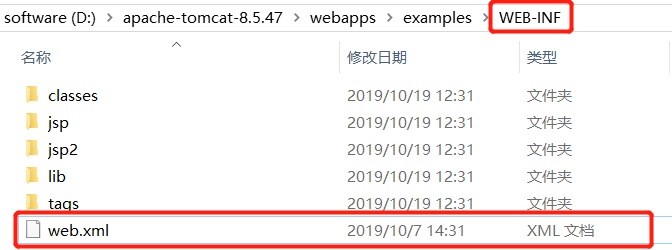
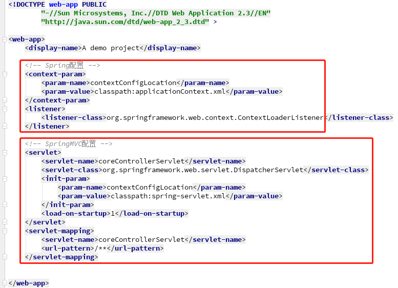
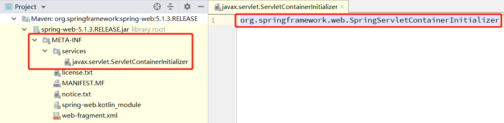
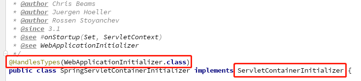
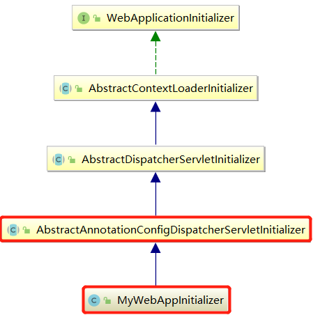

# Spring or Springboot Run with or without External Tomcat

> Java Web 端多多少少总会和 Spring framework 或 Spring boot 产生关联。Spring 相关的技术并不是必须的，但是一个 Java Web 的应用必须要一个运行时的容器，也就是动态 Web 服务器，常用服务器的有 Tomcat、Jetty、Undertow。以 Tomcat 为例，我们来考虑一下，如果使用了 Spring 相关的技术，这两个容器(Spring 容器和 Tomcat 容器)是如何启动的，它们又是怎样一种关系。

> 一般而言，Java Web 应用程序需要一个 web.xml 文件，在这个文件中描述了当前 Web 应用部署的情况，如果这个 Web 应用不包含任何的 servlet、filter、listener 组件，即这是一个静态的 Web 应用，那么就可以不需要这个 web.xml 文件。换句话来说，只包含了静态文件的应用并不需要这个文件。

> 如果是一个动态的 Web 应用呢？是否必须包含这个 web.xml 文件呢？答案是否定的。因为在 `servlet3.0`及其以后的规范中，引入了一个新的特性 --- 共享库/运行时的可插拔特性，基于这一新特性，再配合注解的方式，可以完全替代该  web.xml 配置文件。

> 同时，如果 Java Web 应用被打成了一个 war 包，我们可以将该 war 包放置在一个外部的动态 Web 服务器中，如 Tomcat，随着 Tomcat 的启动，就可以访问该应用了。而 Spring boot 最终将应用打包为一个 jar 包，通过命令行的方式来启动该 Java Web 应用，那么此时的 Web 动态服务容器，就不是外部手动配置的容器了。那 Spring boot 又是如何处理 Web 的动态服务呢？其实是 Spring boot 内置了一个 Web 动态服务器，随着 Spring boot 的启动，也会初始化和运行该内嵌的服务器。那此时就存在着两个容器的启动顺序与激活过程。带着这样的思考，我们来考虑一下几个问题


## 包含 web.xml 的 Java Web 应用

一般而言，Java web 项目都会包含一个 web.xml 的配置文件，通常放置在 WEB-INF 目录中。如下图所示，这是 Tomcat 服务器中自带的一个示例工程，如果打开这个 web.xml 文件，可以看见其中定义了该 web 工程的一些描述信息，包含了 servlet 规范中的三大组件，分别是 servlet、filter、listener。



在了解了基本的 Java web 项目后，我们来考虑一下：如果我们的项目是基于 SpringMVC 开发，最终项目是如何启动的？



如上图所示的，在 web.xml 中配置了 Spring 和 SpringMVC。当项目打成 war 包并部署在 Tomcat 服务器后，当服务器启动时，根据配置文件中信息，Spring 会根据类路径下的 applicationContext.xml 文件进行初始化，这一初始化的开始是由一个 Spring 实现的 listener 来帮助完成的。同时 SpringMVC 的核心控制器也以 servlet 的方式进行了注册，这也就意味者 Tomcat 启动时会初始化这个前端控制器。

由此，可以得知，当我们在 web.xml 中将 Spring 以及 SpringMVC 的信息配置好，当 Tomcat 启动时，会去拉起 Spring 容器的初始化。简言之，Tomcat 驱动 Spring。


## 采用注解的 Java Web 应用

在 Servlet3.0 及以上的规范中，引入了一个重要的新特性：共享库/运行时的可插拔特性。这一特性是这样描述的：

1. 对于每一个应用而言，当应用启动时，由 Web 容器(如 Tomcat )创建一个 ServletContainerInitializer 实例。如果某个框架(如 Spring )提供了 ServletContainerInitializer的实现，Web 容器也会实例化框架提供的这个实例。
2. 但是框架提供的实现，必须绑定在 META-INF/services 目录中的一个叫做javax.servlet.ServletContainerInitializer 的文件中。
3. 除了这种方式外，还可以使用 @HandlesTypes 注解，来注入一些我们感兴趣的类。

在这一新特性的基础上，我们可以基于 Java Config 的方式来完成 Spring 和 SpringMVC 容器的配置，一般 Spring 和 SpringMVC 会配置成一对父子容器( Spring 官方推荐)。

```java
/**
 * web 容器在启动创建对象的时候，就会调用该类的方法来初始化 Spring 容器和前端控制器
 * @author lma
 */
public class MyWebAppInitializer extends AbstractAnnotationConfigDispatcherServletInitializer {

    /**
     * 获取根容器的配置类
     * 相当于以前Spring的配置文件
     * 用于创建根容器(父容器)
     *
     * @return
     */
    @Override
    protected Class<?>[] getRootConfigClasses() {
        return new Class[]{RootConfig.class};
    }

    /**
     * 获取web容器的配置类
     * 相当于以前的SpringMVC的配置文件
     * 用于创建web容器(子容器)
     *
     * @return
     */
    @Override
    protected Class<?>[] getServletConfigClasses() {
        return new Class[]{AppConfig.class};
    }
    
    /**
     * 获取DispatcherServlet的映射信息
     * / : 拦截所有请求(包括静态资源，xxx.js，xxx.png ..)，但不包括 *.jsp
     * /* : 拦截所有请求，包括 *.jsp
     * jsp页面是tomcat的jsp引擎解析
     *
     * @return
     */
    @Override
    protected String[] getServletMappings() {
        return new String[]{"/"};
    }
}
```

当我们自定义一个类 `MyWebAppInitializer`，并继承了 `AbstractAnnotationConfigDispatcherServletInitializer` 后，可以覆写这个类中的方法，在这些方法中，可以以 Java 代码的方式来配置 Spring 的容器。为什么继承了这个 Spring 提供的类以后，Tomcat 容器启动时就可以初始化 Spring 容器和前端控制器。



在 spring-web:xxx.RELEASE.jar 的 META-INF/services 的 javax.servlet.ServletContainerInitializer 文件中有且仅有这个配置类，在这个 `SpringServletContainerInitializer` 类上，有一个 `@HandlesTypes(WebApplicationInitializer.class)` 注解。



这个注解正是 servlet3.0 中提到的 `@HandlesTypes`，通过这个注解可以将 `WebApplicationInitializer` 的实例进行注册。接着来下看 `WebApplicationInitializer` 的继承关系：



现在，我们能够看到整体的执行流程。并且能够清晰地看出，Tomcat 7.0 本版实现了 servlet3.0 规范以后，web.xml 不再是必须品。当我们需要在 Tomcat 容器启动的时候，激活、初始化或实例化一些必要的类时，不再是去 web.xml 中进行配置，而是以 Java config 的方式来实现 --- 在 jar 的 META-INF/services/javax.servlet.ServletContainerInitializer 文件中，以全类名的方式进行配置。就是上面配置 Spring 和 SpringMVC 容器那样。

此时，最后来考虑一下，启动的顺序又是如何？没错，还是 Tomcat 驱动 Spring。

 

## Spring boot 激活内置的 Web 服务器

Spring boot 以 jar 包的形式启动，在启动的过程中，激活 Web 服务器


## Spring boot 在外部的 Web 服务器中运行

Spring boot 项目打为war包，使用外部的 Tomcat 容器，此时外部的 Tomcat 又如何激活Spring boot?

