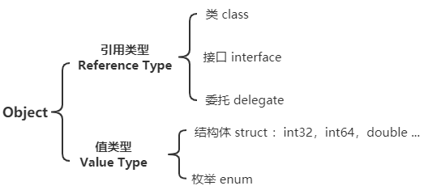
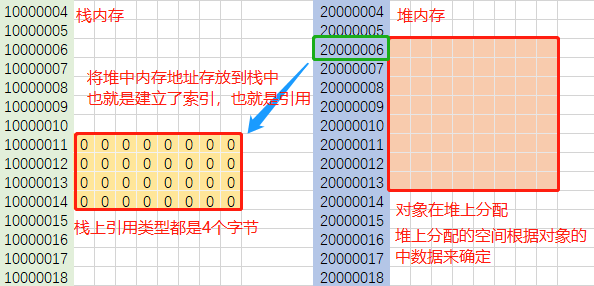
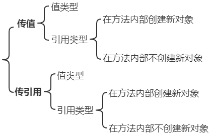
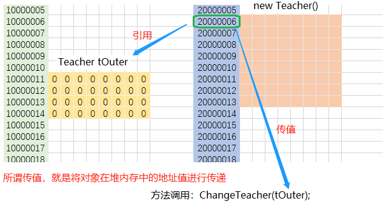
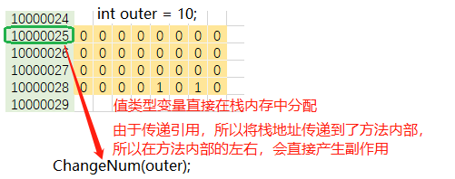
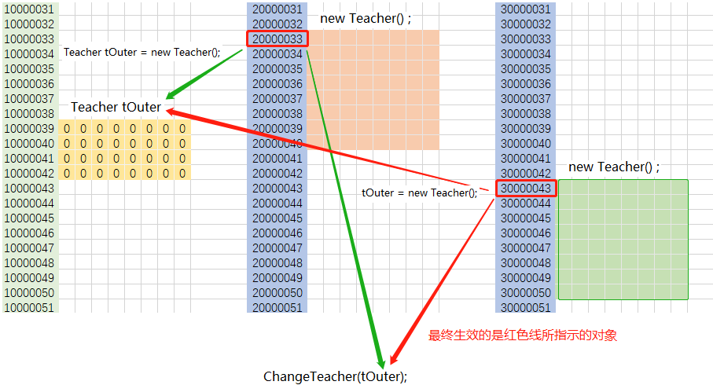
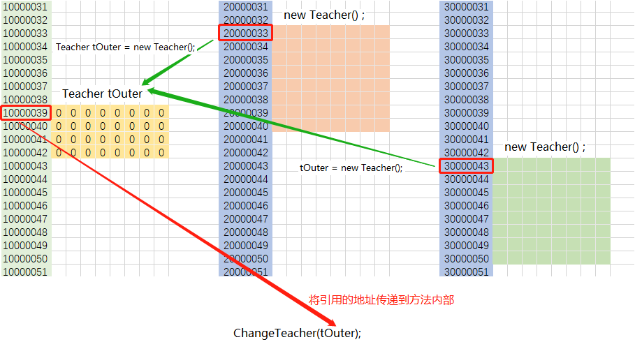
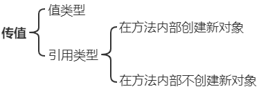
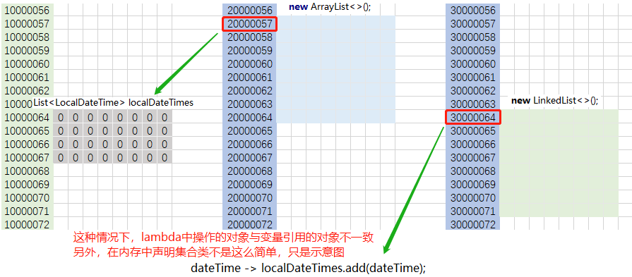
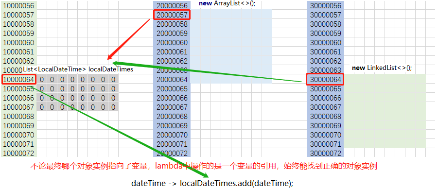

# 从一个编译异常开始，聊一聊 Java 中的传参

当使用 JDK8 中的 lambda 表达式时，在 lambda 表达式中使用一个外部的变量，需要这个变量是被 final 修饰的，或者事实上满足final，如下代码所示：

```java
public static void main(String[] args) {
    String str = "now: ";
    // str = "next: "; 
    // Variable used in lambda expression should be final or effectively final
    Consumer<LocalDateTime> consumer = s -> 
        System.out.println(Thread.currentThread().getName() + " -> " + str + s);
    consumer.accept(LocalDateTime.now());
}
```

虽然没有手动的使用 final 修饰 str 变量，但它确确实实是一个不能修改的变量，这是由于虚拟机进行了优化，可以让程序员不去使用 final 修饰该变量。但如果手动的去修改 str ，就会出现编译异常，详细内容是 `Variable used in lambda expression should be final or effectively final`，为什么会出现这个编译的异常？这是由于虚拟机为了保证 lambda 表达式中操作变量的安全性，如何来理解这个安全性呢？在深刻回答这个问题之前，不妨再来讨论一下 Java 中的数据类型和传值问题。

> 不止是 lambda 表达式中使用的变量需要是final修饰的，JDK8 以前的匿名内部类中使用的变量，也是需要final修饰的

为了更加清楚的描述和解释这些问题，我将结合 C# 中相关的内容来一起说明。


## C# 中数据类型及派生体系



## Java 中数据类型及派生体系


从上面的两幅图中，可以清晰的看到两种语言中的数据类型和派生体系及其相似，可能在值类型的划分有一些细小的区别，但无伤大雅，不妨碍解释今天的问题。

有了数据类型，就可以基于不同的数据类型声明不同的变量，也可以使用这些变量来参与一些计算，这里就涉及到了方法(函数)的使用，首先来看一个简单方法声明和定义。

```java
void someMethod(int num, String name, Object instance) {
    // do something ...
}
```

在上面的方法中，有三个参数，专业称为**形参**，也就是定义方法时使用的形式参数。怎么理解这个形参呢？可以理解为一个占位符。

```java
Object obj = new Object();
someMethod(1,"lma",obj);
```

只有在该方法真正被调用时，传递进来的参数才有意义，调用方法时传递的参数被称为**实参**。如上面的 `1,"lma",obj` 就是实参。

了解了上面的知识，需要接着讨论在方法调用时，到底传递的是什么？想必都听过 Java 中都是传值的，那如何理解这个结论呢？这就需要结合一下 C# 中的相关部分知识，因为在 C# 中，既可以传递值，也可以传递引用。

> 什么是值，什么是引用？需要一些关于虚拟机中变量在堆栈上分配的知识，简单而言，基本数据类型直接会在栈上分配；引用数据类型会在堆中分配这个对象，然后在栈上分配一个变量保存着堆中对象的地址值。举个例子，比如说有一个小孩牵着一个气球，气球就好比是堆中的对象，小孩就好比栈上的变量，牵着的线就好比引用。
>
> 


## C# 中传参的方式



在 C# 中是不仅可以传值，也传递引用，所以就表现出了上面的传参方式。

### 传值 方式

- **值类型**

```c#
// 定义一个方法，形参是一个值类型
static void ChangeNum(int inner)
{
     inner = inner + 1; // 形参的作用域仅仅在这个方法内部，当方法弹栈后，就失效了
}
// 在main方法中调用
static void Main(string[] args)
{
     int outer = 10;
     ChangeNum(outer);
     Console.WriteLine(outer); // 10
}
```


- **引用类型 - 在方法内部创建新的对象**

```c#
// 定义一个方法，形参是一个引用类型，自定义Teacher，包含了 Name 和 ID 两个属性
static void ChangeTeacher(Teacher t)
{
    t = new Teacher() { ID = 2001, Name = "t_inner_first" };
    t.Name = "t_inner_last";
    t.ID = 3001;
    // 由于在方法内部新建了一个对象，所有的操作都是基于方法体内部的新对象
    // 所以内部的操作对方法外的对象是没有任何印象的
}
// 在main方法中调用
static void Main(string[] args)
{
     Teacher tOuter = new Teacher() { ID = 1001, Name = "t_outer" };
     ChangeTeacher(tOuter);
     Console.WriteLine(tOuter.Name); // t_outer  
}
// ** 这种方式极少或几乎不会使用 **
```


- **引用类型 - 在方法内部不创建新的对象**

```c#
// 定义一个方法，形参是一个引用类型，自定义Teacher，包含了 Name 和 ID 两个属性
static void ChangeTeacher(Teacher t)
{
    t.Name = "t_inner";
    t.ID = 2001;
    // 将实参的地址值直接传入，所有的操作都是基于一个相同的对象，方法执行后产生副作用
    // 即改变对象原来的属性
}
// 在main方法中调用
static void Main(string[] args)
{
     Teacher tOuter = new Teacher() { ID = 1001, Name = "t_outer" };
     ChangeTeacher(tOuter);
     Console.WriteLine(tOuter.Name); //  t_inner
}
```

再次通过模拟内存中方法调用的示意图来展示这个过程，由于在方法调用前，tOuter 已经与堆内存中实例的对象建立的关系(通过地址值)，当方法调用时，又将这个这个地址值作为实参传递到方法的内部，所以方法内部的操作都是基于同一个对象，所以对于对象的修改，会直接产生副作用。不要觉得副作用就不好，其实在编码的过程中，绝大多数都是使用的这种方式。顺便说一句，Java 不支持传引用的方式，所以仅支持这种方式。




### 传引用 方式

- **值类型**

```c#
// 特别注意形参前面的 ref 
static void ChangeNum(ref int inner)
{
    inner = inner + 1;
    // 这次运行后，会真真实实的产生副作用
}
// 在main方法中调用
static void Main(string[] args)
{
     int outer = 10;
     ChangeNum(outer);
     Console.WriteLine(outer); // 11
}
```

不是很好理解，为什么加上一个 ref 后，就真实地产生了副作用呢？再次通过模拟内存中方法调用的示意图来展示这个过程。



可能是处于这样问题的考虑，Java 中彻底封死了这条路，所以在 Java 中是不能实现这样的操作。


- **引用类型 - 在方法内部创建新的对象**

```c#
// 特别注意形参前面的 ref 
static void ChangeTeacher(ref Teacher t)
{
    t = new Teacher() { ID = 2001, Name = "t_inner_first" };
    t.Name = "t_inner_last";
    t.ID = 3001;
    // 由于在方法内部新建了一个对象，所有的操作都是基于方法体内部的新对象
    // 所以内部的操作对方法外的对象是没有任何印象的
}
// 在main方法中调用
static void Main(string[] args)
{
     Teacher tOuter = new Teacher() { ID = 1001, Name = "t_outer" };
     ChangeTeacher(tOuter);
     Console.WriteLine(tOuter.Name); // t_outer  
}
// ** 这种方式极少或几乎不会使用 **
```


- **引用类型 - 在方法内部不创建新的对象**

```c#
// 特别注意形参前面的 ref 
static void ChangeTeacher(ref Teacher t)
{
    t.Name = "t_inner";
    t.ID = 2001;
    // 将栈内存中的值传递给到了方法中，由于栈内存的值本质上就是对象的引用
    // 所以相当于方法内部的再次拿到了对象的引用，所有操作本质上都是基于一个对象，所有依然产生了副作用
    // 与上面传值的方式效果一样
    // 即改变对象原来的属性
}
// 在main方法中调用
static void Main(string[] args)
{
    Teacher tOuter = new Teacher() { ID = 1001, Name = "t_outer" };
    // tOuter = new Teacher() { ID = 1002, Name = "t_outer_last" };
    ChangeTeacher(tOuter);
    Console.WriteLine(tOuter.Name); //  t_inner
}
```

可能会产生这样的疑问，既然和上面传值时的效果一样，那这样做的意义在哪里呢？同样地，还是模拟内存中方法调用的示意图来说明。

当首次调用 `Teacher tOuter = new Teacher() { ID = 1001, Name = "t_outer" }` 时，栈内存中保存了对象实例的堆内存地址，如果调用方法的形参没有 `ref` 的修饰，调用方法就将堆内存中该对象的地址传递到方法中，正如上面所说的那样。假如在方法调用前执行了 `tOuter = new Teacher() { ID = 1002, Name = "t_outer_last" }` ，此时传递的就新对象的堆内存地址；



如果调用方法的形参使用了 `ref` 修饰，调用方法传参就是直接将栈内存中的引用地址传递到方法内部，方法内部通过引用地址也可以指向堆内存中的实例对象，所有最终可能起到是相同的副作用，但是内存中运行的模型是不一致的。Java 中是不支持这种方式的，当然这种方式在 C# 中使用的几率也不是很多。




## Java 中传参的方式



在 Java 中只允许传值，所以相当于是 C# 传参方式的一个子集。

通过上面几种方式的描述，基本上了解了传参过程中一些基本知识。Java 只支持传值的方式，在上面 C# 的示例中也展示了，如果使用 Java 代码实现基本上也是一致的。


## 回归正题

上面聊了很多关于 Java 和 C# 中的传值方式，但这些内容与开篇所说的异常又有什么关系呢？

开篇使用的例子中，当 lambda 中调用了一个外部的变量时，我们再次去修改这个变量的值时，就会出现编译异常。`String` 类型的例子可能不是很好说明，所以通过接下来的例子来解释。

```java
public static void main(String[] args) {
    List<LocalDateTime> localDateTimes = new ArrayList<>();
    // localDateTimes = new LinkedList<>();
    Consumer<LocalDateTime> consumer = dateTime -> localDateTimes.add(dateTime);
    consumer.accept(LocalDateTime.now());
    localDateTimes.forEach(System.out::println);
}
```

如上面的代码中，首先创建了一个 `LocalDateTime` 的 list ，然后再 lambda 中添加具体的时间，如果修改这个 list为 `LinkedList` ，就会重新出现 `Variable used in lambda expression should be final or effectively final` 。出现这个异常是因为，虚拟机认为这样的操作是危险的，可能会出现问题。

下面的描述可能有失偏颇，慎重理解。

Java 虚拟机在执行代码顺序时，并不是所想象的那样去顺序执行，内部参杂着很多的即时优化，仅仅保证了最终的一致性，并不保证过程中的按部就班。以 `List<LocalDateTime> localDateTimes = new ArrayList<>();` 为例子，分为了三个动作：声明变量，新建 list 对象，建立变量与对象之间的引用关系，这三个动作的执行顺序并没有得到虚拟机的保证，如果此时执行 `localDateTimes = new LinkedList<>();` ，又包含了两个动作：新建对象，建立引用关系；接着就到了 lambda 表达式的内部，此时需要 `localDateTimes` 变量指向的实例对象来进行 `add` 操作，由于上面包含了**两个**建立引用关系的动作，真正 lambda 中使用的是哪一个列表实例，并不清晰，可能出现混乱。比如，向 lambda 中传递了 `ArrayList`，后面 `localDateTimes` 又指向了 `LinkedList`，导致在 lambda 中真实操作的对象可能不是我们预想的。



如果 Java 能传递引用，就可以有效的避免这个问题，如下图所示：



Java 中的传参方式只能是传递，当变量为值类型时，传递的是栈内存中的变量直接包含的值；当变量为引用类型时，栈中的变量与堆中的实例之间建立了映射关系，真正传递的是，堆中实例对象的内存地址。基于这样的事实，以及虚拟机对于代码执行的优化，可能在一些情形下出现异常。所以为了解决这些问题，虚拟机之间在编译器就会报出这些错，提示程序员这样写不能保证正确性，需要修改编码的方式。

> 对于最后面的解释，可能有失偏颇，需要继续学习 Java 语言层面和虚拟机层面的知识，才能对该知识点有更加深刻和正确的理解。

